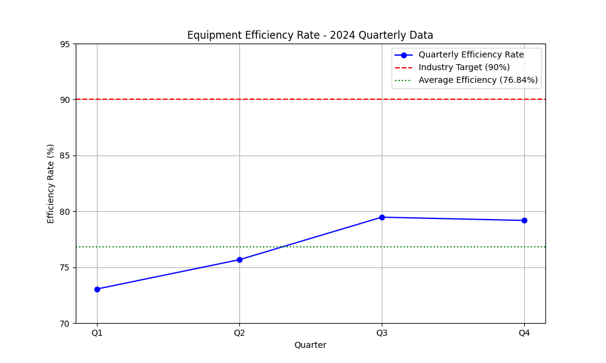

# Manufacturing Performance Analysis: A Data-Driven Case for Predictive Maintenance

**Contact:** 25f1000165@ds.study.iitm.ac.in

## Executive Summary

This report presents a data-driven analysis of our company's equipment efficiency rate for the fiscal year 2024. The analysis reveals a concerning trend of increasing downtime and maintenance costs, with an average equipment efficiency rate of **76.84%**, significantly below the industry benchmark target of 90%. This data story highlights the urgent need for a strategic intervention to improve our manufacturing performance. The key recommendation from this analysis is the implementation of a predictive maintenance program.

## Performance Trend Analysis

The following chart illustrates the equipment efficiency rate over the four quarters of 2024, compared to the industry target.

## Key Findings

1.  **Consistent Underperformance:** Throughout 2024, our equipment efficiency rate has remained significantly below the industry target of 90%.
2.  **Stagnant Growth:** While there was a slight improvement from Q1 to Q3, the efficiency rate plateaued in Q4, indicating that current maintenance strategies are insufficient to bridge the performance gap.
3.  **Significant Performance Gap:** The average efficiency rate of 76.84% is 13.16 percentage points below the industry benchmark, representing a substantial opportunity for improvement.

## Business Implications

The current trend of low equipment efficiency has several negative business implications:

*   **Increased Operational Costs:** Higher downtime leads to increased maintenance costs, overtime for staff, and expedited shipping fees to meet deadlines.
*   **Reduced Production Output:** Inefficient equipment limits our production capacity, potentially leading to lost revenue and market share.
*   **Decreased Competitiveness:** As competitors adopt more advanced maintenance strategies and achieve higher efficiency rates, we risk falling behind in the market.

## Recommendation: Implement a Predictive Maintenance Program

To address the challenges outlined above and achieve the industry target of 90% efficiency, it is imperative that we implement a predictive maintenance program. This program will leverage data from equipment sensors and machine learning algorithms to predict potential failures before they occur.

**Benefits of a Predictive Maintenance Program:**

*   **Reduced Downtime:** By scheduling maintenance proactively, we can minimize unexpected equipment failures and reduce downtime by up to 50%.
*   **Lower Maintenance Costs:** Predictive maintenance allows us to optimize maintenance schedules and reduce unnecessary preventive maintenance, leading to cost savings of up to 40%.
*   **Improved Equipment Lifespan:** By addressing potential issues before they escalate, we can extend the lifespan of our equipment and maximize our return on investment.

By implementing a predictive maintenance program, we can transform our maintenance operations from a reactive to a proactive approach, enabling us to achieve our efficiency targets, reduce costs, and gain a competitive edge in the market.

---

*This analysis was generated with the assistance of Jules (ChatGPT Codex) at https://chatgpt.com/codex/tasks.*
